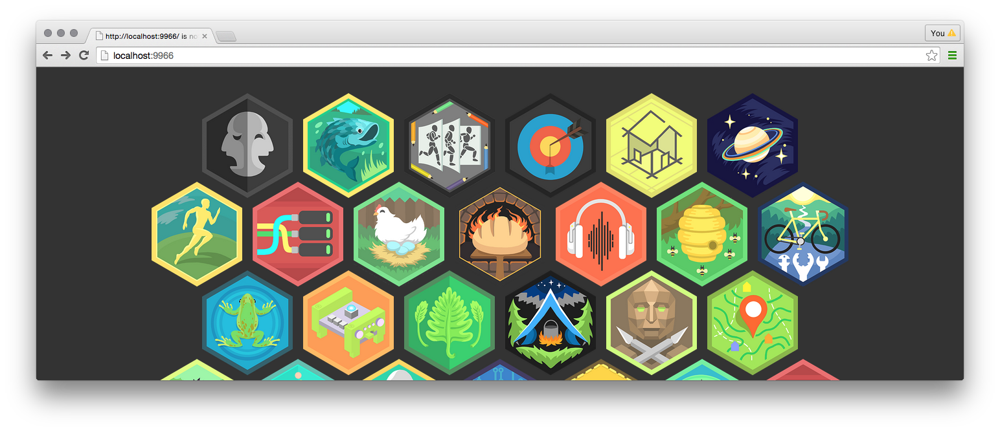

# diy-skill-hex-grid

Layout a grid of skill patches.



# Installation

```
npm install diy/skill-hex-grid
```

# Usage

```js
var g = grid(document.querySelector('.grid-wrapper'), { skills: skills.map(function (s) {
    return {
        img: {
            src: s.images.large,
            alt: s.title + ' Badge'
        },

        href: '/skills/' + s.url
    };
}) });

g.enable();
```

# var g = grid($el, options);

Returns an instance of `SkillHexGrid` which is a wrapper for
[hex-grid](https://github.com/substack/hex-grid).

```
var options = {
    skills: [],
    offset: {
        x: 0,
        y: 0
    }
}
```

## g.disable()

Disables mouseenter and mouseleave interactions.

## g.enable()

Enables mouseenter and mouseleave interactions.
